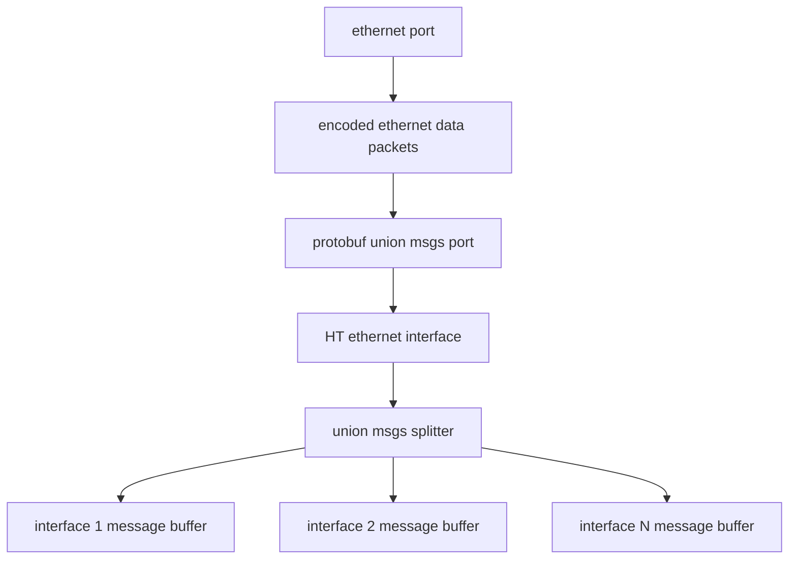

## explanation

### receiving
Packets stream over ethernet and hit the ethernet port itself. The ethernet library has an internal queue for the UDP packets received. We know that a specific port id (say 4521) all messages will be a protobuf union msg that can contain only one of the types of messages that we will be sending (config control, TCU status, CASE msgs, etc.) and the union decoder method in the ethernet interface itself will handle this. The ethernet shall be able to receive multiple messages in one loop (of a limited number) and in between iterations of the loop the ethernet driver will hold the un-parsed messages in it's queue. 

The union message decoder will handle parsing of all of the messages in the queue and will be able to determine what message the union pb packet holds. If all messages of a specific type are needed, The message decoder will then add the decoded particular protobuf message struct to the message queue in the respective interface that way if multiple messages of the same type appear in one loop iteration they can all be processed by the underlying system / interface. If the interface just needs the latest version of a message each loop, the decoder will just update the message instance in its respective interface.
