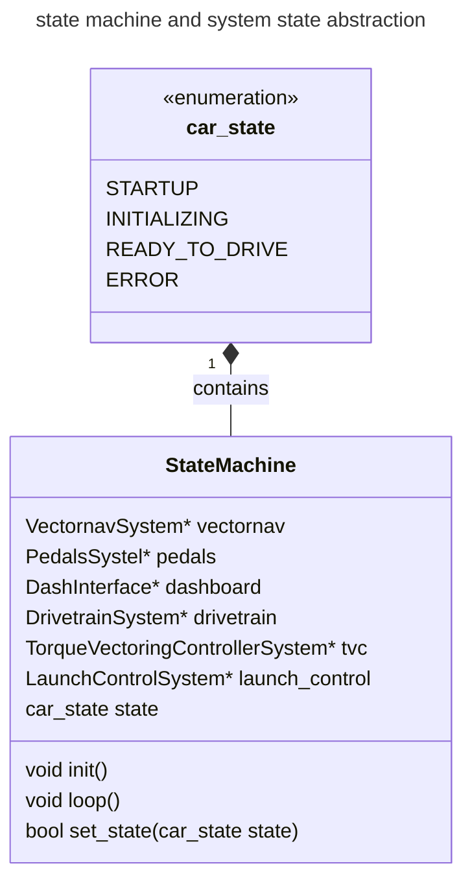
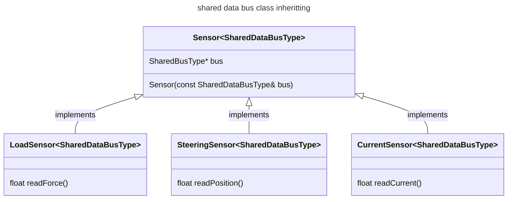
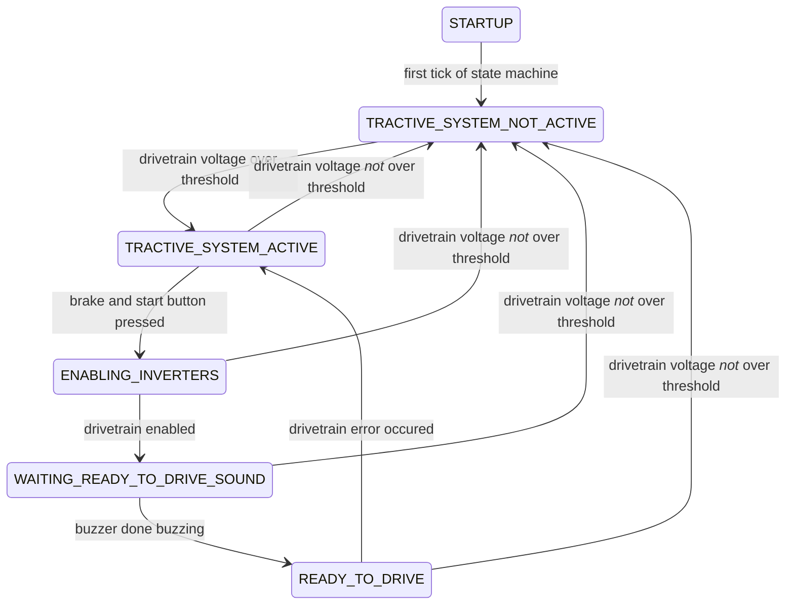
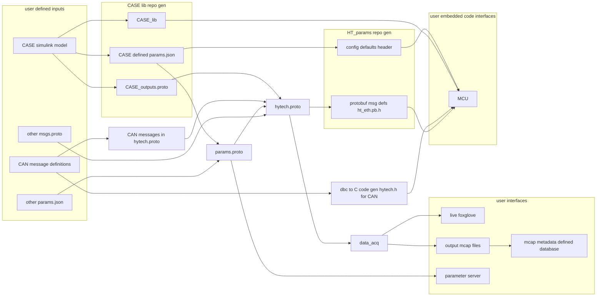

## CASE Library Usage and Updates

> [!IMPORTANT]
> DO THIS ONCE
> Before you begin, you need to add an SSH key to your GitHub account to allow PlatformIO to pull the CASE library. Follow these instructions to set up your SSH key: [GitHub SSH Key Setup](https://docs.github.com/en/authentication/connecting-to-github-with-ssh/adding-a-new-ssh-key-to-your-github-account).

### Updating CASE Library

To update the CASE library, find the latest tag from the repository: [CASE Library Tags](https://github.com/hytech-racing/CASE_lib/tags). Once identified, update the `platformio.ini` file in this repository by replacing the version number in the following line:

```text
git+ssh://git@github.com/hytech-racing/CASE_lib.git#v(INSERT VERSION NUMBER HERE)
```

For example:

```text
git+ssh://git@github.com/hytech-racing/CASE_lib.git#v34
```

## Build, Test, and Run Instructions

This project utilizes [PlatformIO](https://docs.platformio.org/en/latest/) for building, testing, and packaging.

You can use PlatformIO in two ways:
1. [As a VSCode extension](https://docs.platformio.org/en/latest/integration/ide/vscode.html#installation)
2. [Through the PlatformIO Core CLI](https://docs.platformio.org/en/latest/core/installation/methods/installer-script.html)

For a quick guide on using the VSCode extension, refer to the [PlatformIO toolbar](https://docs.platformio.org/en/latest/integration/ide/vscode.html#platformio-toolbar).


### Environments

There are two main environments for this project:
* `test_env`: Used for native testing.
* `teensy41`: Used for building and deploying to the Teensy board.

### Building

To build the project in a specific environment, switch to that environment in PlatformIO and use the build feature ( `check mark` icon) in VSCode. For CLI users, run:

```bash
pio run -e teensy41
```

### Testing

Before merging code into the main branch, ensure all unit tests pass and the code compiles. The Continuous Integration (CI) system will verify this as well, but you can run the tests locally by switching to the `test_env` and executing the unit tests.

In VSCode, navigate to the [Project Tasks Menu](https://docs.platformio.org/en/latest/integration/ide/vscode.html#project-tasks) and select `test_env > Advanced > Test` .

For CLI users, run:

```bash
pio test -e test_env
```

### Uploading

To upload to the Teensy, use the upload feature (arrow icon) in the PlatformIO toolbar, shown [here at number 3](https://docs.platformio.org/en/latest/integration/ide/vscode.html#platformio-toolbar).

### Importance of Unit Tests

> [!WARNING]
> Unit tests MUST be maintained for functionality of the car.

Unit tests ensure the stability of new features and code changes by verifying integration with the existing codebase. The unit tests for this project are located in the `test` folder and are run both locally and in the GitHub CI environment.

Note: CI testing currently only includes system-level tests, not hardware-dependent tests, which can be run locally.

View previous test results here: [GitHub Actions](https://github.com/hytech-racing/MCU/actions).

### VSCode Setup for Auto-completion and Code Navigation

For advanced code navigation and auto-completion, you can generate a `compile_commands.json` file for the build environment. This file is created using the [PlatformIO compiledb task](https://docs.platformio.org/en/latest/integration/compile_commands.html).

To generate the file:
1. Open the PlatformIO terminal in VSCode.
2. Run:

```bash
pio run -t compiledb -e teensy41
```

This will create the `compile_commands.json` file in the `.pio/build/teensy41` folder. You can configure VSCode to use this file by creating a `.vscode/c_cpp_properties.json` file with the following content:

```json
{
    "configurations": [
        {
            "name": "teensy41",
            "includePath": [
                "${workspaceFolder}/**"
            ],
            "cStandard": "c17",
            "cppStandard": "gnu++17",
            "intelliSenseMode": "linux-gcc-x64",
            "compileCommands": "${workspaceFolder}/.pio/build/teensy41/compile_commands.json"
        }
    ],
    "version": 4
}
```

Select this configuration using the VSCode command palette ( `Ctrl+Shift+P` ) and choosing `C/C++: Select a Configuration` .

## Manual CASE Update (Legacy)

1. Generate the `.zip` file for CASE from the HyTech_sim directory.
2. Run the `process_lib.py` script:

```bash
python3 process_lib.py HT08_CONTROL_SYSTEM.zip /path/to/MCU/lib/CASE_lib CASE_lib
```

Replace `/path/to/MCU` with your MCU path.

## System Design and Structure

### Overview

The project is built using different levels of abstraction to maintain logical structure while minimizing complexity.

##### State Diagram Legend

`+` = Public
`-` = Private

#### Level 1: State Machine goals for interface design and implementation

* __Reason for abstraction__: allows for easy swapping and adding of different portable systems and better [separation of concerns](https://en.wikipedia.org/wiki/Separation_of_concerns) from [business logic](https://www.techtarget.com/whatis/definition/business-logic) of the car to the business logic of the system.

Any firmware project that needs to have different states needs each system that creates outputs and / or controls real systems of the car needs can be thought of as each system being controlled by the state machine. What I am thinking is that in a similar fashion to the shared bus, each system can contain a pointer to the state machine. The system can know what state the car is in and based on the state it can determine how to behave. Obviously the state machine also needs to know about what the system is doing as well to determine the state, so the system also needs to be able to pass back data to the state machine. 

For example, our state machine needs to handle understand the state of the pedals system. The pedals dont know about the state of the car, but it does know whether or not the pedals are outputting valid data. Each system can manage their own state and the abstract system base class could contain the set of system-agnostic states through which the statemachine evaluates.

It is only within the logic of our state machine that the systems are allowed to communicate with one another. 

The main idea is that each firmware project has a specific implementation of a state machine, however the systems are portable between firmware projects. Additionally, the systems remain as concrete.



#### level 2 portable Systems: interfaces, logic and structure

* __Reason for abstraction__: these Systems allow us to have board portable pieces so that when newer iterations of boards are made, the same systems that the previous iteration handled can be kept while only the hardware specific code changes. 

For instance, when a new MCU board is created with a new steering sensor input, code within the controller systems will not need to change, only that a new sensor system will be used within the state machine to feed the controller input.

below are some hypothetical system class definitions.


#### level 2 SPI / i2c data bus abstraction from hardware specific implementations

* __Reason for abstraction__: this allows us to create a specific type of system that uses a shared resource, for example multiple sensors on a SPI bus, that each have their own scaling to produce data for feeding other systems.

This is currently aimed at our use of a SPI bus. The read data functions are what convert the data gotten from the shared bus to the real-world values for each one of the sensors. This was being attempted with ADC_SPI versus STEERING_SPI using just copies of the class. 



### state machine documentation



### Running the Tests

PlatformIO is used for CI unit testing. You can run tests locally using:

```bash
pio test -e test_env
```

The CI checks ensure code compiles for the Teensy and that all tests pass.

#### Notes

##### New MCU Code: Definitions and Architecture

- **System Definition**: An abstract sub-system that requires logic from the MCU to handle inputs and outputs.
- **Interface Definition**: Code to pack/unpack data into internal structures for use by systems or logic.

* architecture:
  - over-arching state machine
  - systems level 
      - inverters (multiple)
      - pedals
      - torque / speed controller
      - dashboard interface
      

  - interface level:
      - hytech_can interface
      - spi interfaces: SPI adcs for load cells, steering input, glv, etc.


