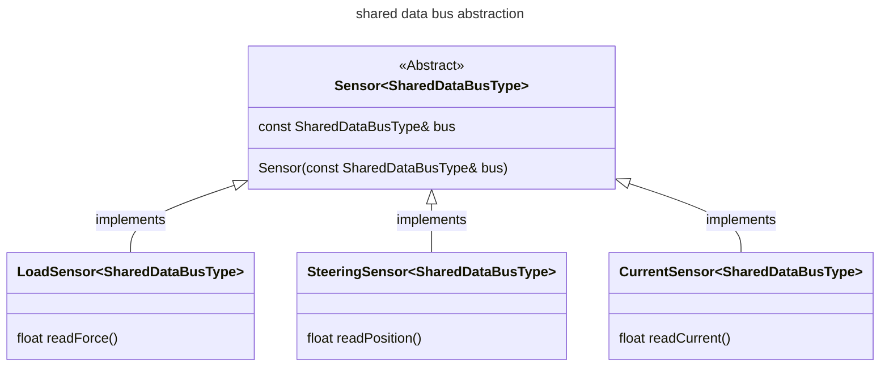

new MCU code:
- component definition:
     an abstract sub-system of the physical car or the code that requires logic to be evaluated by the MCU to determine what input to give it or logic required to handle output from.
- driver definition:
    - code required to purely unpack / pack data into internal structs / classes for use by components or logic
    - I think the best way to handle the driver level is that all the drivers 
- state machine 
- architecture:

    - over-arching state machine
    - components level 
        - inverters (multiple)
        - pedals
        - torque / speed controller
        - driver dashboard
        
    - driver level:
        - hytech_can driver
        - spi drivers: SPI adcs for load cells, steering input, glv, etc.

#### SPI / i2c data bus abstraction from hardware specific implementations
- idea for abstract of the shared bus sensors. This is currently aimed at our use of a SPI bus. The read data functions are what convert the data gotten from the shared bus to the real-world values for each one of the sensors. This was being attempted with ADC_SPI versus STEERING_SPI using just copies of the class. 



#### 


```mermaid
flowchart TD

```