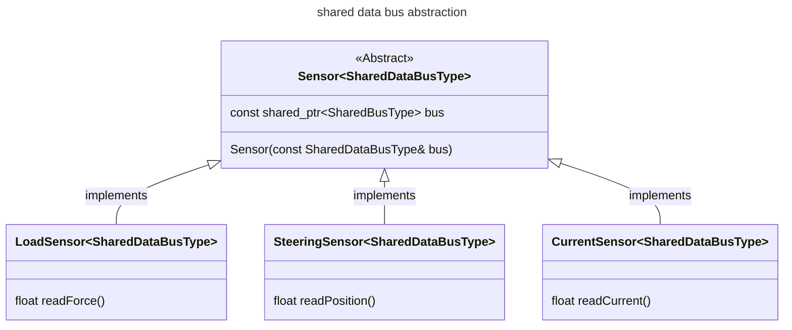
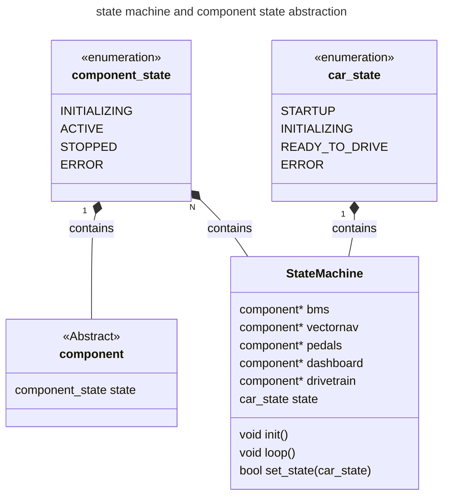

new MCU code:
- component definition:
     an abstract sub-system of the physical car or the code that requires logic to be evaluated by the MCU to determine what input to give it or logic required to handle output from.
- driver definition:
    - code required to purely unpack / pack data into internal structs / classes for use by components or logic
    - I think the best way to handle the driver level is that all the drivers 
- state machine 
- architecture:

    - over-arching state machine
    - components level 
        - inverters (multiple)
        - pedals
        - torque / speed controller
        - driver dashboard
        
    - driver level:
        - hytech_can driver
        - spi drivers: SPI adcs for load cells, steering input, glv, etc.

#### SPI / i2c data bus abstraction from hardware specific implementations
- idea for abstract of the shared bus sensors. This is currently aimed at our use of a SPI bus. The read data functions are what convert the data gotten from the shared bus to the real-world values for each one of the sensors. This was being attempted with ADC_SPI versus STEERING_SPI using just copies of the class. 



#### 

#### state machine goals for interface design and implementation

Any firmware project that needs to have different states needs each component that creates outputs and / or controls real components of the car needs can be thought of as each component being controlled by the state machine. What I am thinking is that in a similar fashion to the shared bus, each component can contain a shared pointer to the state machine. The component can know what state the car is in and based on the state it can determine how to behave. Obviously the state machine also needs to know about what the component is doing as well to determine the state, so the component also needs to be able to pass back data to the state machine. 

For example, our state machine needs to handle understand the state of the pedals component. The pedals dont know about the state of the car, but it does know whether or not the pedals are outputting valid data. Each component can manage their own state and the abstract component base class could contain the set of component-agnostic states through which the statemachine evaluates.

It is only within the logic of our state machine that the components are allowed to communicate with one another. 

The main idea is that each firmware project has a specific implementation of a state machine, however the components are portable between firmware projects. Additionally, the components remain as concrete 




```mermaid
flowchart TD

```