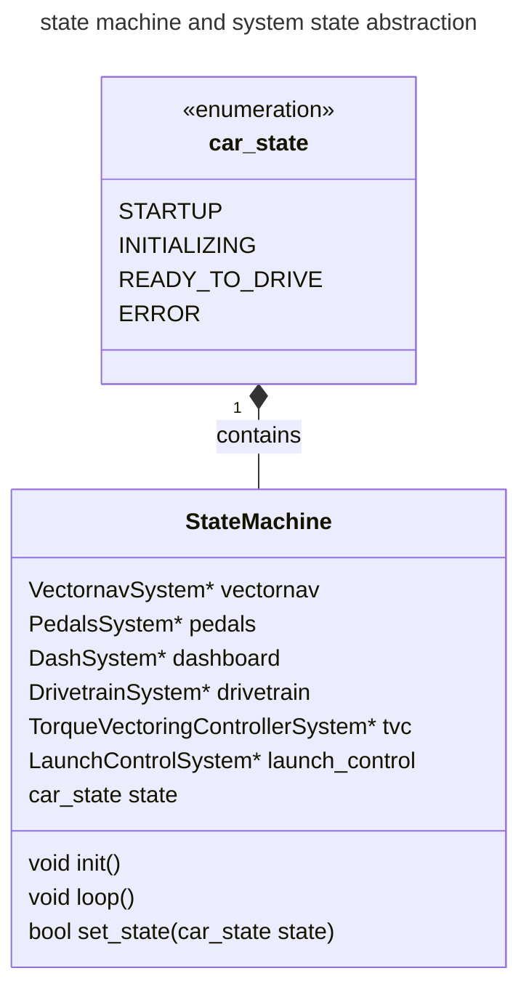
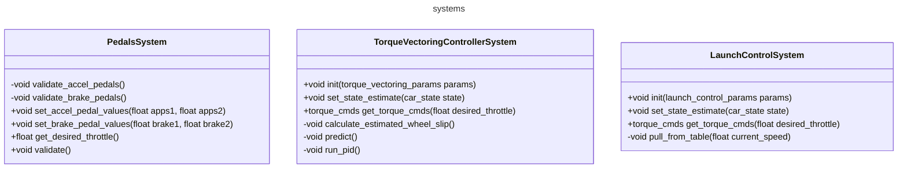
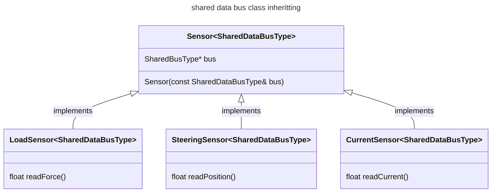
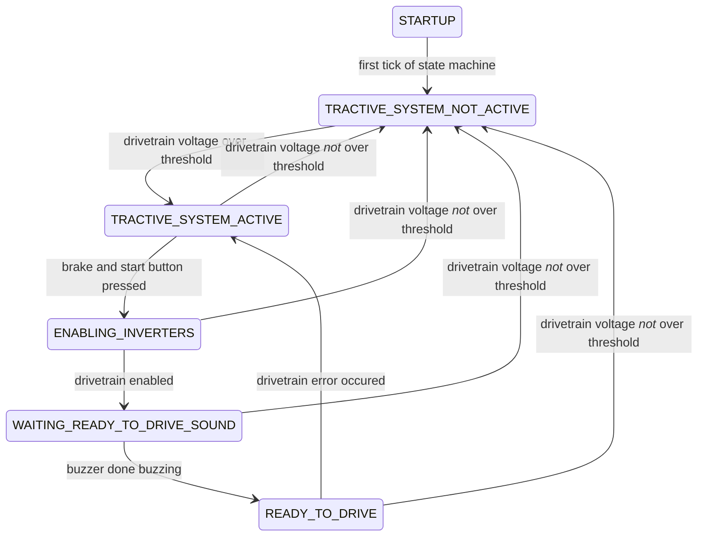

### outline

Levels represent the layer of abstraction they are on. The reason for keeping track of this is to minimize the layers of abstraction for ease of understanding while also creating logical structure and getting maximum benefit per abstraction.

##### state diagram legend

`+`  = Public
`-`  = Private

#### level 1: state machine goals for interface design and implementation
- __Reason for abstraction__: allows for easy swapping and adding of different portable systems and better [separation of concerns](https://en.wikipedia.org/wiki/Separation_of_concerns) from [business logic](https://www.techtarget.com/whatis/definition/business-logic) of the car to the business logic of the system.

Any firmware project that needs to have different states needs each system that creates outputs and / or controls real systems of the car needs can be thought of as each system being controlled by the state machine. What I am thinking is that in a similar fashion to the shared bus, each system can contain a shared pointer to the state machine. The system can know what state the car is in and based on the state it can determine how to behave. Obviously the state machine also needs to know about what the system is doing as well to determine the state, so the system also needs to be able to pass back data to the state machine. 

For example, our state machine needs to handle understand the state of the pedals system. The pedals dont know about the state of the car, but it does know whether or not the pedals are outputting valid data. Each system can manage their own state and the abstract system base class could contain the set of system-agnostic states through which the statemachine evaluates.

It is only within the logic of our state machine that the systems are allowed to communicate with one another. 

The main idea is that each firmware project has a specific implementation of a state machine, however the systems are portable between firmware projects. Additionally, the systems remain as concrete 

#### level 2 portable Systems: interfaces, logic and structure

- __Reason for abstraction__: these Systems allow us to have board portable pieces so that when newer iterations of boards are made, the same systems that the previous iteration handled can be kept while only the hardware specific code changes. 

For instance, when a new MCU board is created with a new steering sensor input, code within the controller systems will not need to change, only that a new sensor system will be used within the state machine to feed the controller input.

below are some hypothetical system class definitions.

#### level 2 SPI / i2c data bus abstraction from hardware specific implementations

- __Reason for abstraction__: this allows us to create a specific type of system that uses a shared resource, for example multiple sensors on a SPI bus, that each have their own scaling to produce data for feeding other systems.

This is currently aimed at our use of a SPI bus. The read data functions are what convert the data gotten from the shared bus to the real-world values for each one of the sensors. This was being attempted with ADC_SPI versus STEERING_SPI using just copies of the class. 

### state machine documentation

#### running the tests

This repo uses platformio testing for CI unit testing. these tests can be run locally with `pio test -e test_env`. The CI checks to ensure that the code both compiles for the teensy and ensures that the tests are passing.

#### notes
new MCU code:
- system definition:
     an abstract sub-system of the physical car or the code that requires logic to be evaluated by the MCU to determine what input to give it or logic required to handle output from.
- interface definition:
    - code required to purely unpack / pack data into internal structs / classes for use by systems or logic

- architecture:

    - over-arching state machine
    - systems level 
        - inverters (multiple)
        - pedals
        - torque / speed controller
        - dashboard interface
        
    - interface level:
        - hytech_can interface
        - spi interfaces: SPI adcs for load cells, steering input, glv, etc.
