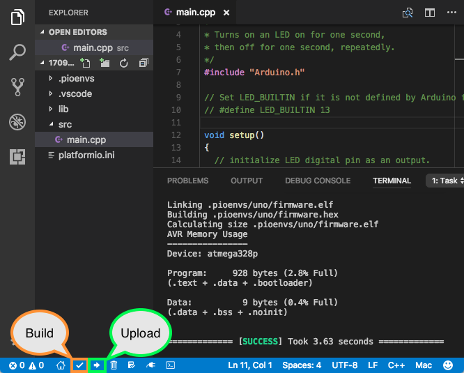

## using and updating CASE

#### DO THIS ONCE
you will need to add ssh key to your github account to allow platformio to pull in CASE as a library. 

[follow these instructions on how to do this.](https://docs.github.com/en/authentication/connecting-to-github-with-ssh/adding-a-new-ssh-key-to-your-github-account)

#### UPDATING CASE

to update case, look for the latest tag at this repo: https://github.com/hytech-racing/CASE_lib/tags

and then in the `platformio.ini` file in this repository, change the number at this line:

`git+ssh://git@github.com/hytech-racing/CASE_lib.git#v(INSERT NUMBER HERE)`

for example: 
    ```git+ssh://git@github.com/hytech-racing/CASE_lib.git#v34```

## building testing and running
This project uses [Platformio](https://docs.platformio.org/en/latest/) for building, testing, checking and packaging. 

There are two main options for using Platformio:
1. [as a VSCode extension](https://docs.platformio.org/en/latest/integration/ide/vscode.html#installation)
2. [the platformio core CLI](https://docs.platformio.org/en/latest/core/installation/methods/installer-script.html)

Quick start guide on how to use VSCode's extension through the [platformio toolbar](https://docs.platformio.org/en/latest/integration/ide/vscode.html#platformio-toolbar)



The main thing to understand is that there exists two "environments" that this project gets built in (`test_env`). One of them is for native running of tests and the other is for building for the teensy and deploying to the teensy (`teensy41`). 

### Building
To build the project for an environment, simply use platformio build check mark after switching to the specified `env`

To build using platformio core CLI simply run `pio run -e teensy41`

### Testing


Before your feature / code addition / branch can get put into the `master` branch you must ensure the unit tests run with your code and that your code compiles. The remote CI will check your work and ensure that your code compiles and that it passes the unit tests however to check locally simply switch to the `test_env` and run the unit tests. This can be done through the VSCode IDE extension through the [project tasks menu](https://docs.platformio.org/en/latest/integration/ide/vscode.html#project-tasks) and selecting under `test_env` > `Advanced` > `Test`.


To test using platformio core CLI simply run `pio test -e test_env`.

### Uploading

To upload to the teensy simply use the platformio upload arrow shown [here at number 3](https://docs.platformio.org/en/latest/integration/ide/vscode.html#platformio-toolbar).

##### On Implementing and Importance of tests
Unit tests are a great way to ensure that new features and new code in general can integrate and work well with other code. It provides a framework to verify that your stuff works the way it should and lets you know when and how it doesnt. 

This project uses unit tests in the `test` folder to for both local testing and testing in the CI on github.

The remote github CI testing currently only encompases system level testing and not the hardware dependent testing that is available locally for running.

You can see results of previous test runs on commits here: https://github.com/hytech-racing/MCU/actions

These MUST be maintained for functionality of the car. 

### setup vscode 
##### with auto-completition and advanced navigation using compile commands


the `compile_commands.json` file is a file that gets generated in the build folder upon excution of the [compiledb platformio task](https://docs.platformio.org/en/latest/integration/compile_commands.html) that sets up the include paths for vscode. [more about compile_commands.json here](https://clangd.llvm.org/design/compile-commands).

If you enter the platformio terminal, you can generate compile commands with 
1. 

then 
2. ```pio run -t compiledb -e teensy41```


this will generate the compile commands for the `teensy41` environment which is the environment we use to build and flash to the car. in a similar fashion, other environments (eg: `test_env`) can have their compile commands generated.

3. then you need to setup vscode to recognize where this file is, which gets put into the `.pio` folder in your workspace. To do this, simply create a `.vscode` folder in the workspace and add a file called `c_cpp_properties.json` and it should look like this:

```json
{
    "configurations": [
        {
            "name": "teensy41",
            "includePath": [
                "${workspaceFolder}/**"
            ],
            "defines": [],
            "cStandard": "c17",
            "cppStandard": "gnu++17",
            "intelliSenseMode": "linux-gcc-x64",
            "compileCommands": "${workspaceFolder}/.pio/build/teensy41/compile_commands.json"
        }
    ],
    "version": 4
}
```
then you can select this configuration to be used with [this c/c++ extension](https://marketplace.visualstudio.com/items?itemName=ms-vscode.cpptools) in vscode for auto-completition and code navigation. 

to select the configuration, use the hotkey `ctrl+shift+p` to open the command prompt in vscode, and then type \`C/C++: Select a Configuration\` and then select your configuration for which you named above.

## updating CASE (manual / old way)

1. generate the .zip file in HyTech_sim by generating the code for CASE
2. while in the HyTech_sim directory, there exists `process_lib.py`. use this by running:
```
python3 process_lib.py HT08_CONTROL_SYSTEM.zip /path/to/MCU/lib/CASE_lib CASE_lib
```
while ensuring that you fill in your path to MCU.

3. profit

## Design Lore of the Code
### outline

Levels represent the layer of abstraction they are on. The reason for keeping track of this is to minimize the layers of abstraction for ease of understanding while also creating logical structure and getting maximum benefit per abstraction.

##### state diagram legend

`+`  = Public
`-`  = Private


#### level 1: state machine goals for interface design and implementation
- __Reason for abstraction__: allows for easy swapping and adding of different portable systems and better [separation of concerns](https://en.wikipedia.org/wiki/Separation_of_concerns) from [business logic](https://www.techtarget.com/whatis/definition/business-logic) of the car to the business logic of the system.


Any firmware project that needs to have different states needs each system that creates outputs and / or controls real systems of the car needs can be thought of as each system being controlled by the state machine. What I am thinking is that in a similar fashion to the shared bus, each system can contain a pointer to the state machine. The system can know what state the car is in and based on the state it can determine how to behave. Obviously the state machine also needs to know about what the system is doing as well to determine the state, so the system also needs to be able to pass back data to the state machine. 

For example, our state machine needs to handle understand the state of the pedals system. The pedals dont know about the state of the car, but it does know whether or not the pedals are outputting valid data. Each system can manage their own state and the abstract system base class could contain the set of system-agnostic states through which the statemachine evaluates.

It is only within the logic of our state machine that the systems are allowed to communicate with one another. 

The main idea is that each firmware project has a specific implementation of a state machine, however the systems are portable between firmware projects. Additionally, the systems remain as concrete 


#### level 2 portable Systems: interfaces, logic and structure

- __Reason for abstraction__: these Systems allow us to have board portable pieces so that when newer iterations of boards are made, the same systems that the previous iteration handled can be kept while only the hardware specific code changes. 

For instance, when a new MCU board is created with a new steering sensor input, code within the controller systems will not need to change, only that a new sensor system will be used within the state machine to feed the controller input.

below are some hypothetical system class definitions.


#### level 2 SPI / i2c data bus abstraction from hardware specific implementations

- __Reason for abstraction__: this allows us to create a specific type of system that uses a shared resource, for example multiple sensors on a SPI bus, that each have their own scaling to produce data for feeding other systems.

This is currently aimed at our use of a SPI bus. The read data functions are what convert the data gotten from the shared bus to the real-world values for each one of the sensors. This was being attempted with ADC_SPI versus STEERING_SPI using just copies of the class. 


### state machine documentation


#### running the tests

This repo uses platformio testing for CI unit testing. these tests can be run locally with `pio test -e test_env`. The CI checks to ensure that the code both compiles for the teensy and ensures that the tests are passing.


#### notes
new MCU code:
- system definition:
     an abstract sub-system of the physical car or the code that requires logic to be evaluated by the MCU to determine what input to give it or logic required to handle output from.
- interface definition:
    - code required to purely unpack / pack data into internal structs / classes for use by systems or logic

- architecture:

    - over-arching state machine
    - systems level 
        - inverters (multiple)
        - pedals
        - torque / speed controller
        - dashboard interface
        
    - interface level:
        - hytech_can interface
        - spi interfaces: SPI adcs for load cells, steering input, glv, etc.
